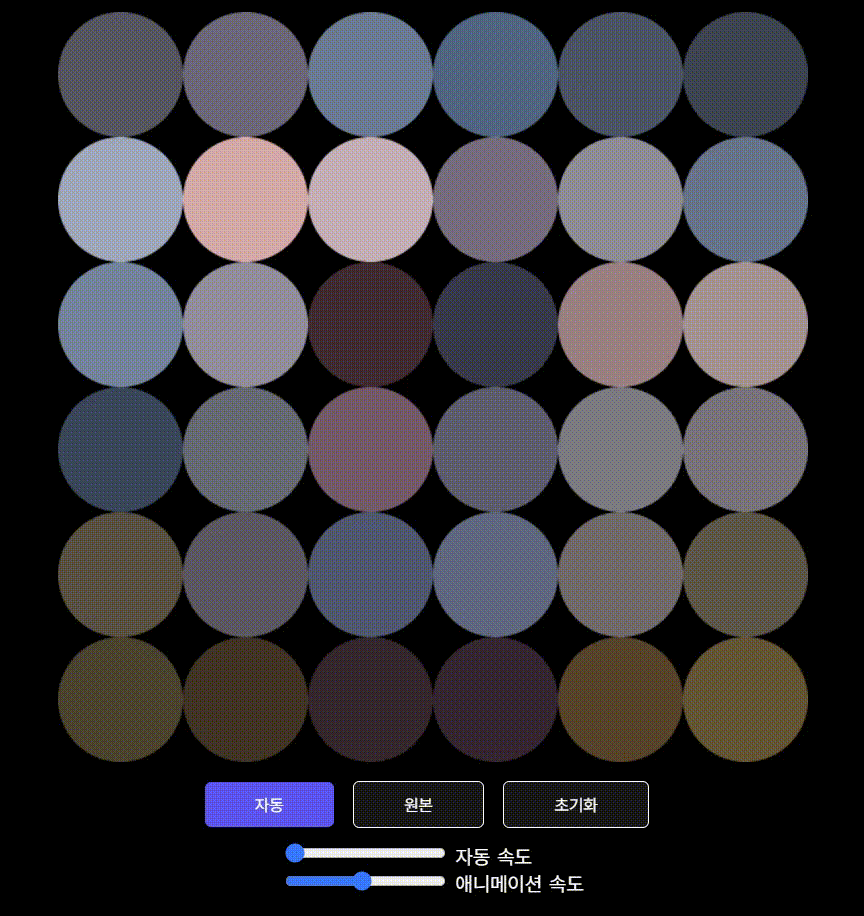

<h1 align="center">Welcome to Canvas Dot Drawing 👋</h1>

<br>

### 🏠 [HomePage](https://dotdrawing.netlify.app/)  


<br>

## :page_with_curl: ​Description

> Canvas Dot Interaction
<br>

### 개요

- 마우스/터치를 이용한 캔버스 인터렉션

<br>

### 주요기능

- cell들을 비율에 맞춰 그리기 위한 이미지 크기 자동 리사이징
- PC/Mobile 대응 가능
- 마우스/터치로 cell들을 분열시켜 이미지를 도트화
- 자동 분열 기능
- 애니메이션 분열 속도 조절 가능

<br>


## :mag: Overview

<br>

### Mouse/Touch Interaction



<br>

### Auto Animation


<br>

<br>

<br>

## :wrench: ​Tech Stack

- Vite  `2.9.9`
- typed.js `2.0.12`
- fontfaceobserver `2.1.0`
- deploy `netlify`


<br>
<br>

## :runner: Steps to run

```bash
$ npm install 
$ npm run dev
```


